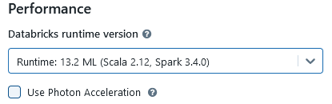

> **⚠ This guide assumes that all commands are executed from the repository root, if not stated otherwise**

# Prerequisites

1. Azure account with active subscription
2. Azure Data Lake Storage Gen2 (hierarchical) containing the source data (hotels, weather and expedia)
3. Bash-compatible environment such as WSL
4. [Terraform CLI](https://developer.hashicorp.com/terraform/tutorials/azure-get-started/install-cli)
5. [Azure CLI](https://learn.microsoft.com/en-us/cli/azure/install-azure-cli-linux?pivots=apt)

# Running the notebook

1. Create the infrastructure 
    - Make `create-azure-env.sh` script executable. To do this, run
        ```sh
        chmod +x create-azure-env.sh
        ```
    - Run the script:
        ```sh
        ./create-azure-env.sh
        ```
    During the execution, the script will ask for 3 inputs:
    1. Azure region: name of Azure location to create all of the resources, including Terraform state
    2. Prefix for the resources: unique prefix which will be prepended to the names of the resources created by this script
    3. Prior to creating the infrastructure, Terraform will ask you if you want to apply it. Please type "`yes`":
        ```
        Do you want to perform these actions?
          Terraform will perform the actions described above.
          Only 'yes' will be accepted to approve.

         Enter a value: yes
        ```

2. Open Databricks workspace
    - Go to Azure Portal
    - Open the resource group containing Azure Databricks Service resource. The group's name will have the following format: `rg-<your prefix>-<azure location>`:

        

    - Go to Azure Databricks Service and open the workspace by clicking "Launch Workspace" button:

        

3. Create cluster in Databricks
    - Open Databricks Workspace
    - From the left menu, go to "Compute" page
    - Press "Create compute" button in the upper-right corner:

        

    - Provide the data required by Databricks for cluster template. For "Databricks runtime version", please choose:

        

    - Press "Create compute" and wait until the cluster is initialized

4. Import the notebook
    - In Databricks Workspace, go to "Workspace" page
    - Choose "Home" tab
    - In the upper-right corner, press **⫶** button and choose "Import":

        

    - Use the dialog to upload the notebook for this exercise (it's in "notebooks" directory of this repo). Then press "Import":

        

    - Open the notebook from the list

5. Running the notebook
    - Connect the notebook to the cluster if needed:

        

    - Upload the wine datasets to your DBFS share as stated in the notebook

    - Run the cells one by one, following the instructions